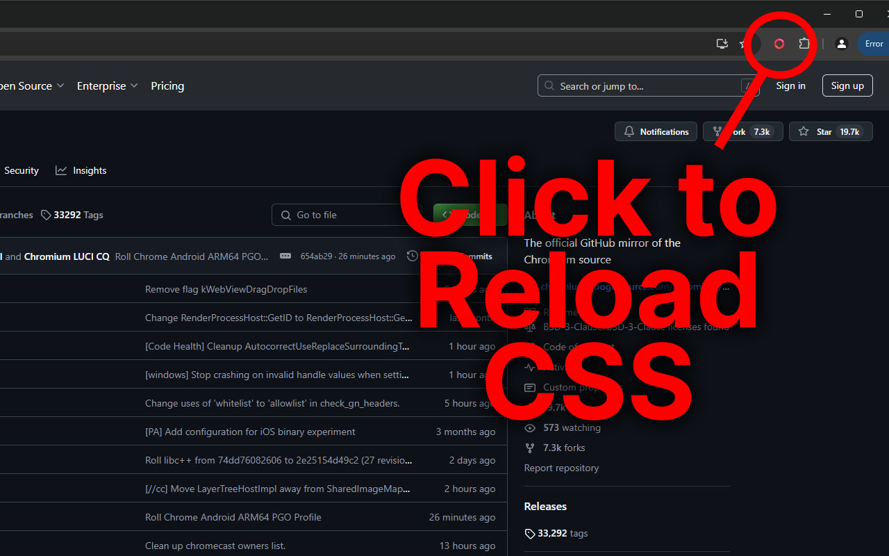
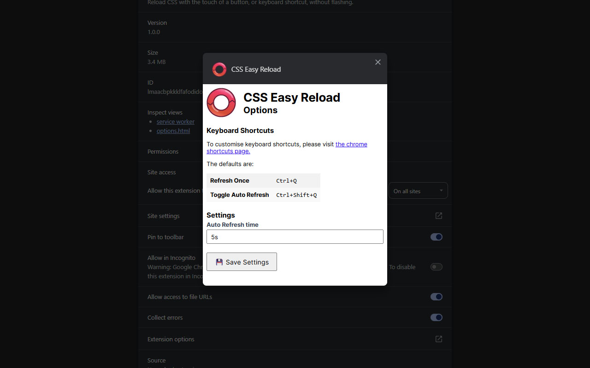

<h1> Easy CSS Reloader</h1>

Reload CSS with the click of a button.

Also supports reload with keyboard shortcut.

Refreshes CSS without page flash by first copying and injecting new styles, then once loaded, deleting the old ones.



Supports auto reloading after a set time:



## Packaging

To package this extension, run:

```
npm run package
```

The packaged extension should appear in ```easy-css-reload.zip```.

The packaging script is really simple, and is found in ```package.js```.
